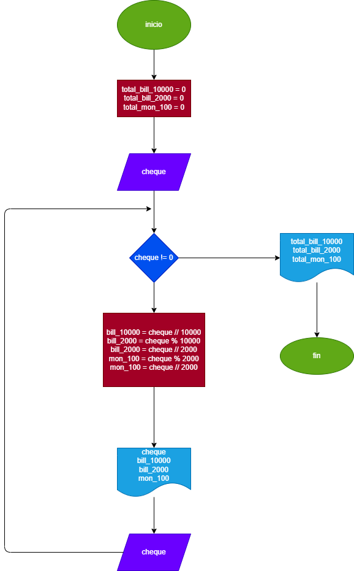

# EJERCICIO 3
El cajero de un banco solo dispone de billetes de $10000, de $2000  y monedas de $100. Su función es cambiar los cheques a los clientes, dándoles el menor número posible de billetes, asumiendo que todos los cheques son multiplos de $100, hacer el diagrama de flujo y el programa de python que reciba el valor del cheque a cambiar y que le informe al cajero cuantos billetes de cada denominación debe entregar. Como nose sabe cuantos clientes vienen en un dia, el programa debe terminar cuando reciba ceros como valor del cheque, y al final del dia debe informar cuantos billetes de cada denominación se gastaron.

